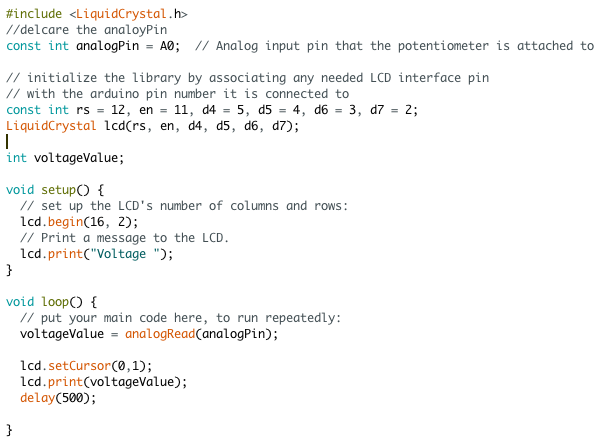

# Make a Digital Timer!
 
## Overview
For this assignment, you are going to 

A) [Solder your LCD panel](#part-a-solder-your-lcd-panel)

B) [Write text to an LCD Panel](#part-b-writing-to-the-lcd) 

c) [Using a time-based digital sensor!](#part-c-using-a-time-based-digital-sensor)

D) [Make your Arduino sing!](#part-d-make-your-arduino-sing)

E) [Make your own timer](#part-e-make-your-own-timer) 
 
## In The Report
Include your responses to the bold questions on your own fork of [this lab report template](https://github.com/FAR-Lab/IDD-Fa18-Lab2). Include snippets of code that explain what you did. Deliverables are due next Tuesday. Post your lab reports as README.md pages on your GitHub, and post a link to that on your main class hub page.

## Part A. Solder your LCD panel

**Take a picture of your soldered panel and add it here!**

## Part B. Writing to the LCD
 
**a. What voltage level do you need to power your display?**
  We need 5V to power the display

**b. What voltage level do you need to power the display backlight?**
  Around 2.5V

**c. What was one mistake you made when wiring up the display? How did you fix it?**
  Initially, the output voltage of the potentialmeter was so low that I could not see the "hello world". Then I adjusted the potentialmeter and the "hello world" appeared.

**d. What line of code do you need to change to make it flash your name instead of "Hello World"?**
  I need to change the argument of lcd.print function and replace "Hello, World" with my name.
 
**e. Include a copy of your Lowly Multimeter code in your lab write-up.**

[Video](https://youtu.be/m-HNpAT1uU0) 

## Part C. Using a time-based digital sensor

**Upload a video of your working rotary encoder here.**

## Part D. Make your Arduino sing!

**a. How would you change the code to make the song play twice as fast?**
  I need to change the following line. By replacing 1000 with 500, the song will play twice as fast. 

int noteDuration = 1000 / noteDurations[thisNote];

**b. What song is playing?**
  Star War

## Part E. Make your own timer

**a. Make a short video showing how your timer works, and what happens when time is up!**
 
[Timer Video](https://youtu.be/J6TXTABcc8E)
 
**b. Post a link to the completed lab report your class hub GitHub repo.**
