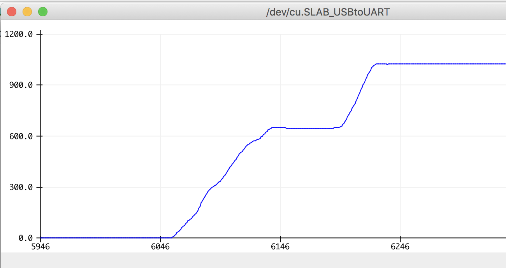
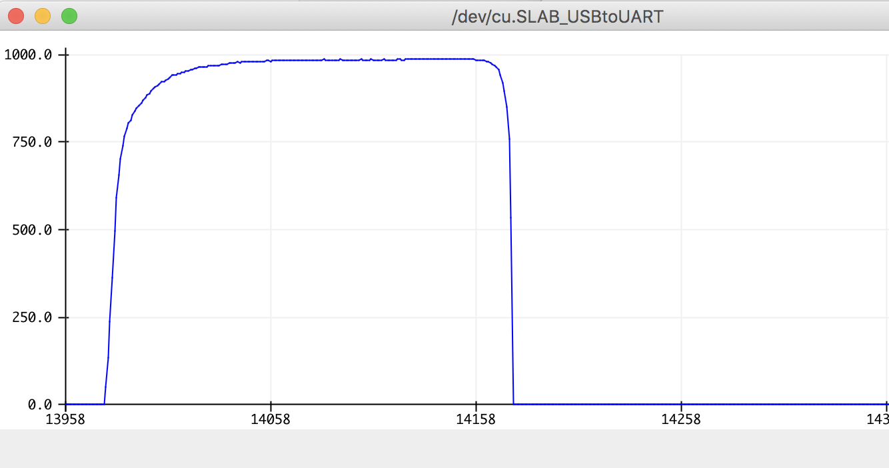
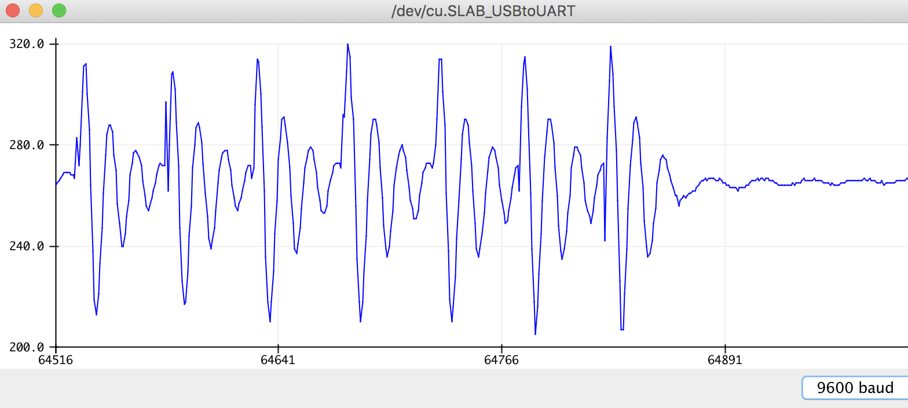
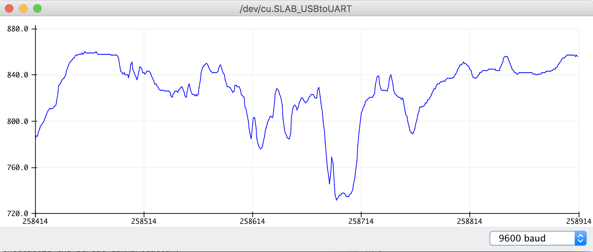
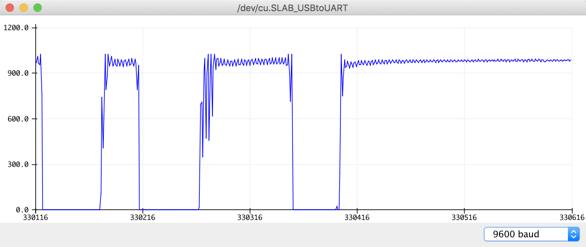

# Data Logger (and using cool sensors!)

*A lab report by John Q. Student.*

## In The Report

Include your responses to the bold questions on your own fork of [this lab report template](https://github.com/FAR-Lab/IDD-Fa18-Lab2). Include snippets of code that explain what you did. Deliverables are due next Tuesday. Post your lab reports as README.md pages on your GitHub, and post a link to that on your main class hub page.

For this lab, we will be experimenting with a variety of sensors, sending the data to the Arduino serial monitor, writing data to the EEPROM of the Arduino, and then playing the data back.

## Part A.  Writing to the Serial Monitor
 
**a. Based on the readings from the serial monitor, what is the range of the analog values being read?**
  The range is from 0 to 1023.

 
**b. How many bits of resolution does the analog to digital converter (ADC) on the Arduino have?**
 10 bits.

## Part B. RGB LED

**How might you use this with only the parts in your kit? Show us your solution.**
  By outputing high voltage to the RGB pins in turn, we can turn on R, G, B leds one by one. And by adjusting the brightness of RGB led, we can change the overall color. 

## Part C. Voltage Varying Sensors 
 
### 1. FSR, Flex Sensor, Photo cell, Softpot

**a. What voltage values do you see from your force sensor?**
 
When released, the reading is about 0; When the force is applied , the reading is about 1000. 

**b. What kind of relationship does the voltage have as a function of the force applied? (e.g., linear?)**
  
For FSR, not linear. When little force applied, the voltage increased significantly. However, if we increase the force applied, the voltage stopped increasing.

**c. Can you change the LED fading code values so that you get the full range of output voltages from the LED when using your FSR?**
  Yes. 

**d. What resistance do you need to have in series to get a reasonable range of voltages from each sensor?**
  the resistance needs to be smaller than the max resistance of the sensor and also bigger than min resistance of the sensor to get a reseasonable range of voltages.

**e. What kind of relationship does the resistance have as a function of stimulus? (e.g., linear?)**
 
`output_voltage = 5V * 27k ohm/(27k ohm + sensor_resistance)
`

  For FSR, the curve of output voltage: 

  for flex sensor, the curve of output voltage: 

  For Photo Cell, the curve of output voltage: 

  Fpr softpot, the curve of output voltage:

### 2. Accelerometer
 
**a. Include your accelerometer read-out code in your write-up.**
 

### 3. IR Proximity Sensor

**a. Describe the voltage change over the sensing range of the sensor. A sketch of voltage vs. distance would work also. Does it match up with what you expect from the datasheet?**

**b. Upload your merged code to your lab report repository and link to it here.**

## Optional. Graphic Display

**Take a picture of your screen working insert it here!**

## Part D. Logging values to the EEPROM and reading them back
 
### 1. Reading and writing values to the Arduino EEPROM

**a. Does it matter what actions are assigned to which state? Why?**

**b. Why is the code here all in the setup() functions and not in the loop() functions?**

**c. How many byte-sized data samples can you store on the Atmega328?**

**d. How would you get analog data from the Arduino analog pins to be byte-sized? How about analog data from the I2C devices?**

**e. Alternately, how would we store the data if it were bigger than a byte? (hint: take a look at the [EEPROMPut](https://www.arduino.cc/en/Reference/EEPROMPut) example)**

**Upload your modified code that takes in analog values from your sensors and prints them back out to the Arduino Serial Monitor.**

### 2. Design your logger
 
**a. Insert here a copy of your final state diagram.**

### 3. Create your data logger!
 
**a. Record and upload a short demo video of your logger in action.**
