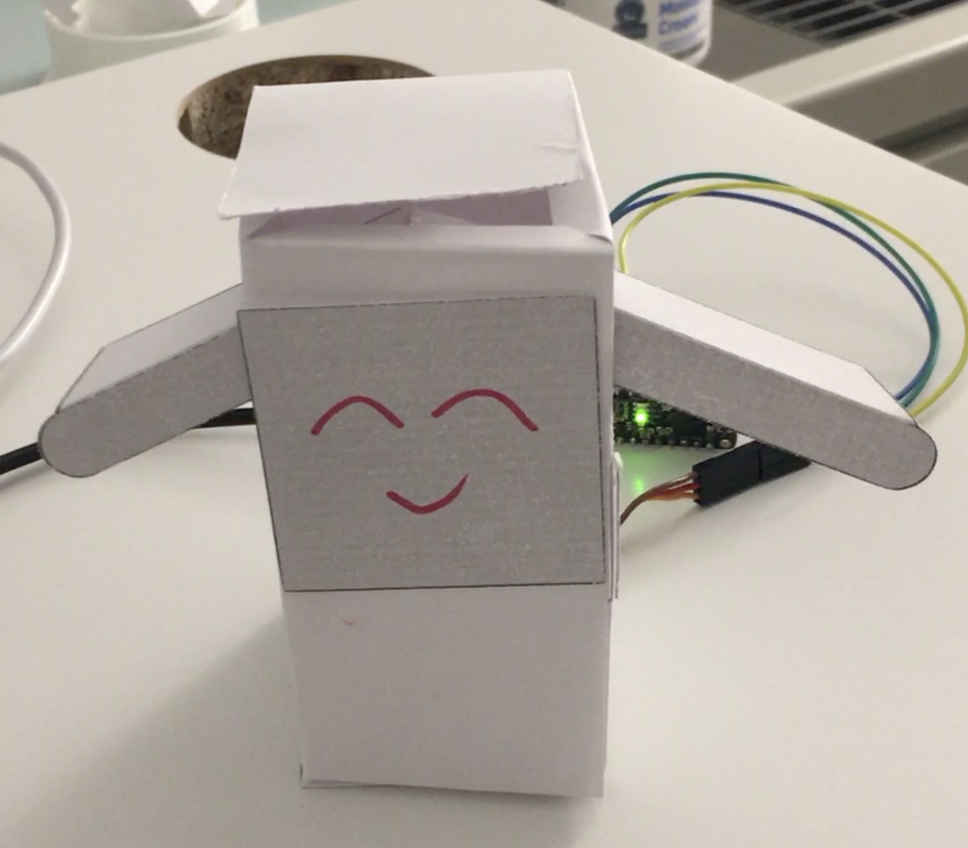

# Paper Puppets

*A lab report by John Q. Student*

## In this Report

To submit your lab, clone [this repository](https://github.com/FAR-Lab/IDD-Fa18-Lab4). You'll need to describe your design, include a video of your paper display in operation, and upload any code you wrote to make it move.

## Part A. Actuating DC motors

**Link to a video of your virbation motor**
 
I forgot to take the picture before the Paper Puppet lab.
  analogWrite(led, brightness) applies voltage to DC motors. The greater the value of 'brightness', the higher percentage of the PWM wave is on and therefore, the DC motor shake more violently. 

## Part B. Actuating Servo motors

### Part 1. Connect the Servo to your breadboard

**a. Which color wires correspond to power, ground and signal?**
  
The power wire is red. The ground wire is brown. The signal pin is orange.

### Part 2. Connect the Servo to your Arduino

**a. Which Arduino pin should the signal line of the servo be attached to?**
  PIN 9

**b. What aspects of the Servo code control angle or speed?**
 
myservo.write(pos) tells servo to go to the angle defined by 'pos'.
 
delay(15) defines the interval between two movement, that is, the speed of servo. If we want to speed up, we should decrease the delay number.

## Part C. Integrating input and output

**Include a photo/movie of your raw circuit in action.**

## Part D. Paper puppet

**a. Make a video of your proto puppet.**

[Video](https://youtu.be/cA46KFo4h6o)

## Part E. Make it your own
**a. Make a video of your final design.**
 
