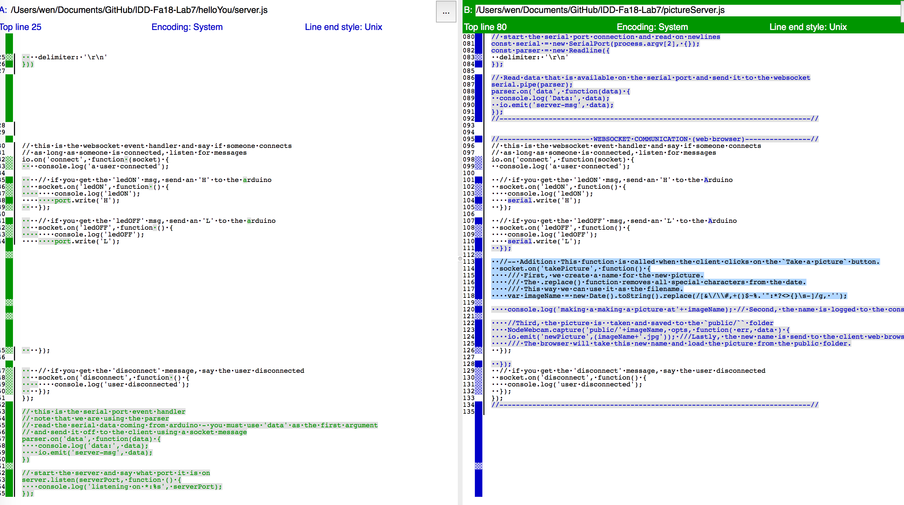
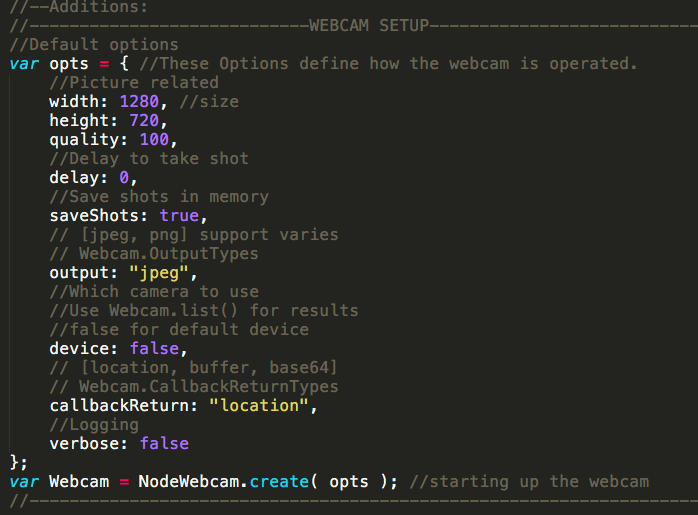
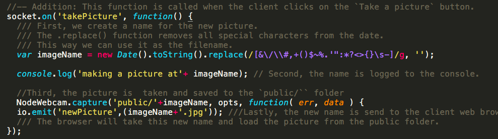
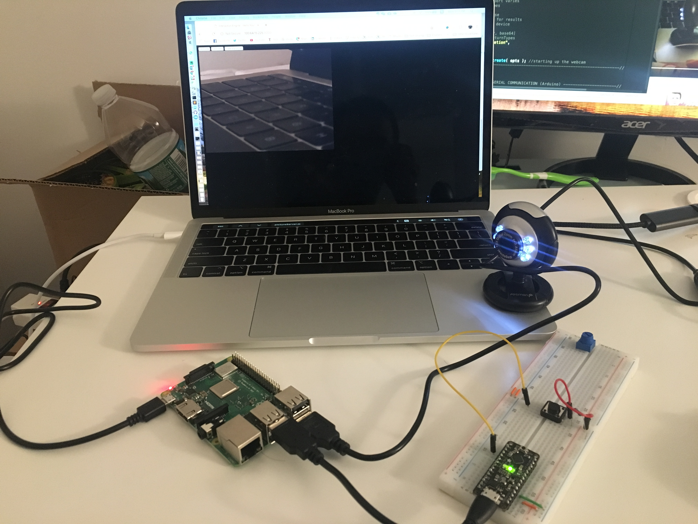
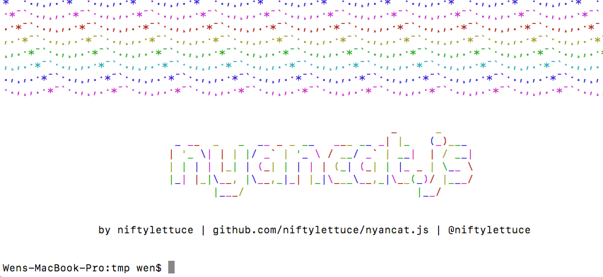
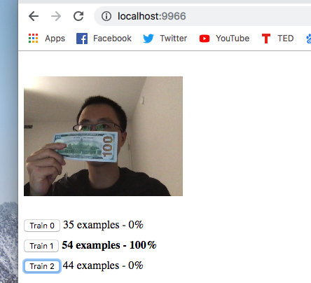
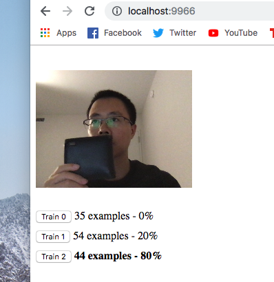

# Video Doorbell, Lab 7

*A lab report by Wen Guo*

### In This Report

1. Upload a video of your version of the camera lab to your lab Github repository
1. As usual, update your class Hub repository to add your [forked IDD-Fa18-Lab7](/FAR-Lab/IDD-Fa18-Lab7) repository.
1. Answer the questions in-line below on your README.md.

## Part A. HelloYou from the Raspberry Pi

[Video](https://youtu.be/me-7qpGVxWo)
 

## Part B. Web Camera

**a. Compare `helloYou/server.js` and `IDD-Fa18-Lab7/pictureServer.js`. What elements had to be added or changed to enable the web camera? (Hint: It might be good to know that there is a UNIX command called `diff` that compares files.)**

This is the setup of the webcam: 

The following is the code that takes picture when I press the button. 

**b. Include a video of your working video doorbell**
 
[Video](https://www.youtube.com/watch?v=w1Jryqgt8Us)

## Part C. Make it your own

**a. Find, install, and try out a node-based library and try to incorporate into your lab. Document your successes and failures (totally okay!) for your writeup. This will help others in class figure out cool new tools and capabilities.**

I tried the nyacat. 

I also tried the [Teachable Machine Boilerplate](https://github.com/googlecreativelab/teachable-machine-boilerplate). After training the model, it can classify the image into one of the three categories. 

[Video](https://youtu.be/NcIqb9qi05Y)
 

**b. Upload a video of your working modified project**
