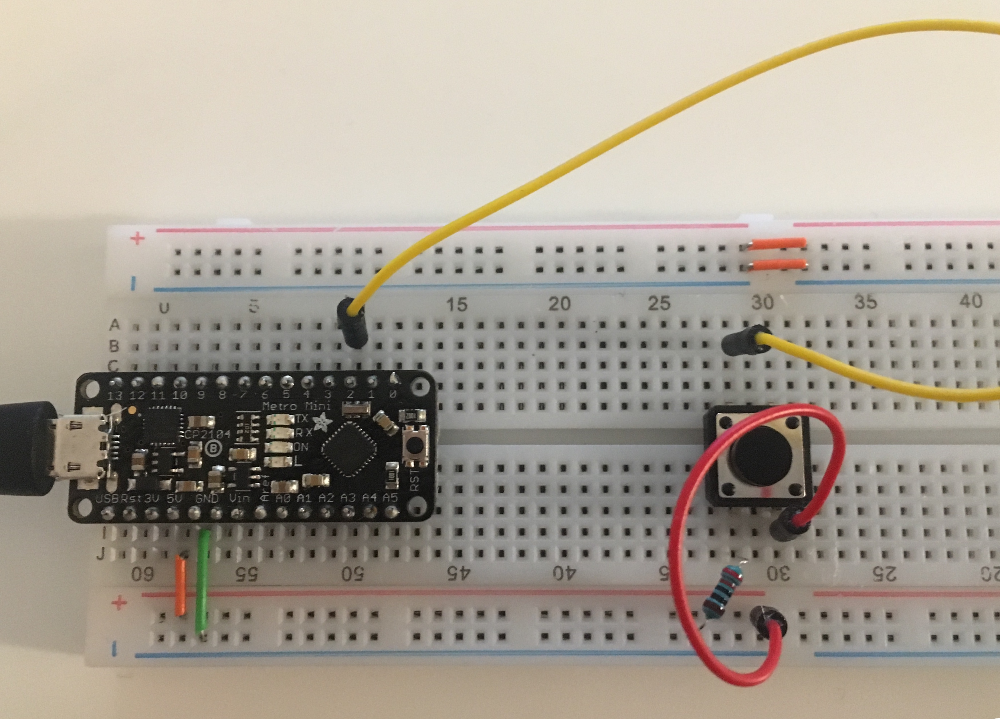
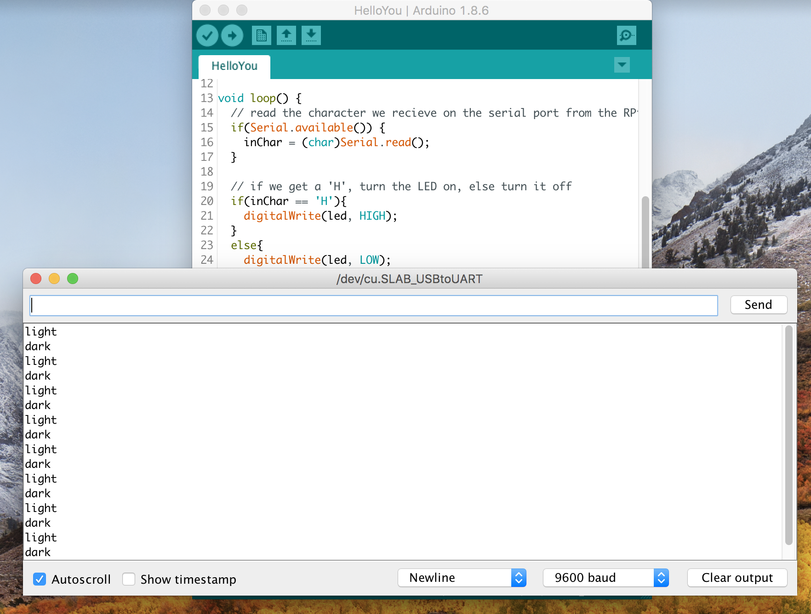

# Video Doorbell, Lab 7

*A lab report by Wen Guo*

### In This Report

1. Upload a video of your version of the camera lab to your lab Github repository
1. As usual, update your class Hub repository to add your [forked IDD-Fa18-Lab7](/FAR-Lab/IDD-Fa18-Lab7) repository.
1. Answer the questions in-line below on your README.md.

## Part A. HelloYou from the Raspberry Pi

[Video](https://youtu.be/me-7qpGVxWo)

